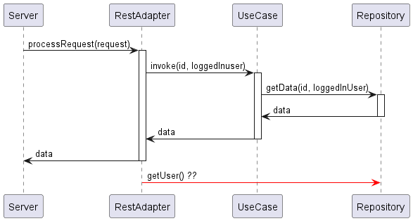

# Scoped Values

<!-- TOC -->
* [Scoped Values](#scoped-values)
  * [Erklärung](#erklärung)
    * [Verwendung:](#verwendung)
  * [Aufgabe](#aufgabe)
<!-- TOC -->

## Erklärung
Scoped Values sind eine Form von impliziten Methodenparametern, die es ermöglichen, einen oder mehrere Werte (d. h. 
beliebige Objekte) an eine oder mehrere weit entfernte Methoden zu übergeben, ohne sie als explizite Parameter zu jeder 
Methode in der Aufrufkette hinzufügen zu müssen.

Sie sind nur während der Laufzeit des an die `run(...)`-Methode übergebenen `Runnable`s gültig und werden danach (sofern 
keine weiteren Referenzen auf sie existieren) zur Garbage Collection freigegeben.

Ein Scoped Value ist unveränderlich – er kann nur durch das oben erwähnte Rebinding für einen neuen Scope neu gesetzt 
werden.

Die durch`StructuredTaskScope` erzeugten Kind-Threads haben Zugriff auf den Scoped Value des Eltern-Threads.

### Verwendung:
Scoped Values werden statisch mit einem generischen Parameter **initialisiert**:
```java
public class Foo {
    
    public static ScopedValue<Bar> MY_SCOPED_BAR = ScopedValue.newInstance();
    
    private void doFoo() {
        // hier wird dann der Wert des Scoped Values übergeben
        // und der Scope definiert:
        OtherClass otherClass = new OtherClass();
        Bar bar = initBar();
        
        // Variante für void-Methoden
        ScopedValue.where(MY_SCOPED_BAR, bar)
                .run(() -> otherClass.process());
        
        // Variante für Methoden mit Return-Type:
        Object result = ScopedValue.where(MY_SCOPED_BAR, bar)
                .call(() -> otherClass.getObject());
        
        // Solange der Callstack otherClass.process() existiert und eine Referenz auf unser Scoped Value 
        // existiert, ist der Wert verfügbar
    }
}
```
Und so kann der Wert wieder abgerufen werden:

```java
public class OtherScope {
    private void doSomethingWithMyBar() {
        Foo.MY_SCOPED_BAR.get();
    }
}
```

## Aufgabe

Die Klasse `Server` erzeugt diesen Code-Flow:



- Entferne User als Methoden-Parameter aus allen fraglichen Klassen
  - `RestAdapter`
  - `UseCase`
  - `Repository`
- Verwende das **Scoped Value Feature**, in der Klasse `Server`,
damit das Objekt User nicht mehr als Parameter durch die Methoden durchgereicht werden muss.<br>
- verwende das ScopedValue in `Repository`, um wieder an den User zu kommen.

**Anmerkung:** Im TestModul findet ihr die Klasse 
[ServerTest](../../../../../../../test/java/ch/erni/javafeatures/scoped/values/ServerTest.java).<br>
Mit ihr könnt ihr prüfen, ob die Funktionalität noch gewährleistet ist.

## Quellen
- [happycoders Java 23 Features](https://www.happycoders.eu/de/java/java-23-features/#Scoped_Values_Third_Preview_-_JEP_481)
- [happycoders Scoped Values](https://www.happycoders.eu/de/java/scoped-values/)
- [Youtube What Scoped Values in Java 21?](https://www.youtube.com/watch?v=U2UgxHYO2bE)
